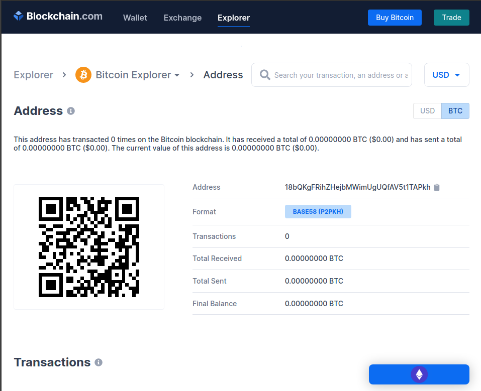

Understanding the blockchain and decentralized applications is hard. Learning fundamental concepts makes it easier to understand. In this article, basic concepts of bitcoin keys are explored based on programming perspective. They can be really useful when you want to implement blockchain apps like wallets, mining software, bitcoin explores, bitcoin e-commerce etc.

## What is decentralization in bitcoin
Decentralized systems are are interconnected systems  where no party has overall control of they system. As digital payment system, bitcoin provide this form of system where there is no central entity (like banks) that control the flow of transactions.

## The cryptography behind: keys and signatures
Digital keys and signatures are fundamental to decentralization of trust. Bitcoin uses pair of related keys(private and public) based on public-key cryptography. Private keys are only known to owner while public keys are may be known by anyone. A sender encrypts a message with receiver's public key(shared publicly) , and sends it publicly, it can only be decrypted with receiver's private keys.  
<br/>

In bitcoin transaction *Digital Signature or witness* is used to prove that one has a private key connected to public key without revealing the private key. Private keys are used to produce digital signature. While signature can be *verified* by anyone with public key, it can only be *produced* by someone with knowledge of private key. This concept of verification of transactions is important because bitcoin is based on peer to peer network.

## Comparing to bank account terms
Recipient's public key is not shared publicly itself, it is represented by bitcoin address which works as beneficiary name in banking. Private keys are like passcode and public keys are like account numbers. Witness or digital signature is like normal hand signature that shows you are the owner of account.

## The fun part: generating keys
Basically keys are just strings of characters e.g `30848827712021293731208415302456569301499384652082` in decimal or     `4433d156ea29436f29a94e0ccc5d58df8e57bdc8583c32` in hexadecimal.    
<br/>

All these keys are related to each other. Hash function are used to transform keys from one form to another e.g from private key to form public keys, public keys to bitcoin address.
<br/>

## Generating private keys
Generating keys is like choosing random number. Bitcoin uses 256-bits number for randomness. Any number is picked at range of `1 to ~2**256`. Simply a binary number with 256 1s and 0s like:-  
`000100011011010110010001001101101100101...`  

`2**256` is very huge number ~ `10**77`, which is much larger than  number of atoms in and on the earth approximately `10**50` !!!(Imagine a number with 50 figures).  

This binary number can be converted to decimal number (contain numbers 0-9)    
`80101199751367646086581405402432952544...`  

Or into hexadecimal (contain 0-9 numbers plus 6 alphabet characters a-f)  
`11B59136CB932F78ACB0EE67864D23A830D1BF...`  
<br/>
Here is the code..

```javascript
const sha256 = require(sha256)

let privKey = sha256('secret')
console.log('> Private Key: ',privKey)
// > Private Key:  2bb80d537b1da3e38bd30361aa855686bde0eacd7162fef6a25fe97bf527a25b
```

## Base58check encoding   
The above key is hexadecimal(**Hex**), represented in Base64 which includes 64 characters(52 lowercase and capital letters, 10 numerals, 2 more characters "+" and "/" ).   
Some character can be easily mistaken or confused e.g letter l, number 1 and letter I, letter O and zero 0.   
Bitcoin uses Base58 encoding to represent keys, the same as Base64 but it excludes 6 characters(0,O,l,I,+ and /). So the bitcoin Base58 alphabet is `123456789ABCDEFGHJKLMNPQRSTUVWXYZabcdefghijkmnopqrstuvwxyz`    

**Base58check** encoding is like error-checking code, it prevents inscriptional errors.  

## Generating private key WIF
The Base58check encoded private key with 5 prefix is called **Wallet Import Format(WIF)** which is used in importing and exporting keys in wallets and generating QR codes.   
It can be done in four steps
1. We add version byte(0x80 in hex) which is used as prefix in encoding private keys(prefix + private key).  
2. SHA256 is applied twice(double-SHA) to prefixed private key to get checksum.
3. First bytes of checksum is appended to result of step 1 and the result is encoded into base58 format.

Lets write some code to do the trick, with help of `sha256` and `bs58` libraries.  

``` javascript
const sha256 = require('sha256')
const base58 = require('bs58')

let doubleHash =  sha256.x2('80' + privKey)
let  checksum = doubleHash.substring(0, 8);
let payload = Buffer.from('80'+privKey+checksum, 'hex')
let b58 = base58.encode(payload )

console.log("> Private Key WIF: ", b58)
// > Private Key WIF:  5J9YKiVU3AWNkCa2zfQpj1f2NAeMQhLsYU51N8NM28J1bSNQL2S
```  

## Generating public key from private key
Because private key is your secret, we can use the private key to create signature that anyone can verify without having the actual private key with the help of public key.
Public key is generated from private key by using one way cryptographic function called [*Elliptic Curve Multiplication*](https://en.wikipedia.org/wiki/Elliptic_curve_point_multiplication) where its easy to do in one direction but impossible to do in reverse. It involves some complex maths, you can learn more math [here](https://fangpenlin.com/posts/2019/10/07/elliptic-curve-cryptography-explained/) and [here](https://en.wikipedia.org/wiki/Elliptic_curve_point_multiplication#:~:text=Elliptic%20curve%20scalar%20multiplication%20is,producing%20a%20one%2Dway%20function.).  

> Elliptic-curve cryptography (ECC) is an approach to public-key cryptography based on the algebraic structure of elliptic curves over finite fields. ECC allows smaller keys compared to non-EC cryptography (based on plain Galois fields) to provide equivalent security. - Wikipedia  

In bitcoin, there is special parameters for elliptic curve called `secp256k1` with ECDSA algorithms as defined in [Standards for efficient Cryptography(SEC)] learn [more](https://en.bitcoin.it/wiki/Secp256k1).  

Lets focus on coding part, we use javascript implementation of elliptic curves (`elliptic` library) to generate public key from private key and `secp256k1` for curve standard elliptic curve parameters.   

``` javascript
    // new instance of elliptic curve with secp256k1 parameters
    let EC = require('elliptic').ec
    let ec = new EC('secp256k1')

    // our previous generated private key
    privKey = '2bb80d537b1da3e38bd30361aa855686bde0eacd7162fef6a25fe97bf527a25b'    
    // generate key pairs from curve
    let kp = ec.keyFromPrivate(privKey);
    // get public key point (x,y)
    let pubPoint = kp.getPublic()

    // get uncompressed public key
    let pubKey = pubPoint.encode('hex')

    console.log("> Uncompressed Public Key : ", pubKey)
    // > Uncompressed Public Key :  04a02b9d5fdd1307c2ee4652ba54d492d1fd11a7d1bb3f3a44c4a05e79f19de933924aa2580069952b0140d88de21c367ee4af7c4a906e1498f20ab8f62e4c2921

```

## Compressing the public key.
Because the public key is the point in the curve, it is represented in form of coordinates x and y. Uncompressed public key contains prefix(04) + x coordinates + y coordinates making 520 bits of data. Compression of public key reduces size used by 50% hence reduce the cost of transaction. To compress a public key, only add a prefix to x coordinate. A prefix depends on the nature of y coordinates. If y coordinate is even, then a prefix is 02, else prefix is 03.
> Tip: Hexadecimal number is even if it is divisible by 2, meaning it end with 0,2,4,6,8,A,C, and E.  

```javascript
    let ec = new EC('secp256k1')
    privKey = '2bb80d537b1da3e38bd30361aa855686bde0eacd7162fef6a25fe97bf527a25b'    

    let kp = ec.keyFromPrivate(privKey);
    let pubPoint = kp.getPublic() // Public key point from a curve.

    // get coordinates
    let x = pubPoint.getX();
    let y = pubPoint.getY();

    let  pub = { x: x.toString('hex'), y: y.toString('hex') };
    // x = a02b9d5fdd1307c2ee4652ba54d492d1fd11a7d1bb3f3a44c4a05e79f19de933
    // y = 924aa2580069952b0140d88de21c367ee4af7c4a906e1498f20ab8f62e4c2921
    // we use '03' prefix because y is odd (ends with 3)

    compressedPub = '03'+pub.x
    console.log("> Compressed Public Key : ", compressedPub)
    // > Compressed Public Key :       03a02b9d5fdd1307c2ee4652ba54d492d1fd11a7d1bb3f3a44c4a05e79f19de933

```


## Generating bitcoin address from public key
Bitcoin address is an actual string of alphanumeric characters that can be shared with anyone want to send you money. In bitcoin transactions, it appears as *recipient* of funds. Usually start with 1 or 3.    

Bitcoin address is derived from public key through one-way cryptographic hashing algorithms specifically, *Secure Hash Algorithm(SHA256)* and *RACE Integrity Primitives Evaluation Message Digest (RIPEMD160)*. A public key is passed on SHA256, the result is computed with RIPEMD160  to generate public key hash which is then encoded with base58check encoding. the result is bitcoin address B.

Starting with public key P.

`Bitcoin Address = RIPEMD160(SHA256(P))`. We can use specified javascript implementations to do the trick  

```javascript
const sha256 = require('sha256')
const base58 = require('bs58')
const ripemd160 = require('ripemd160')

// using our public key
let pubKey = '03a02b9d5fdd1307c2ee4652ba54d492d1fd11a7d1bb3f3a44c4a05e79f19de933'

let addrHash = new ripemd160().update(sha256(pubKey)).digest('hex')
console.log("> Unencoded Bitcoin Address: ", addrHash)

// base58check encoding
let doubleHash =  sha256.x2(Buffer.from('00' + addrHash, 'hex'))
let checksum = doubleHash.substring(0, 8);
let payload = Buffer.from('00'+addrHash+checksum, 'hex')
let encodedAddr = base58.encode(payload)

console.log("> Bitcoin Address: ", encodedAddr)
//> Bitcoin Address:  18bQKgFRihZHejbMWimUgUQfAV5t1TAPkh
```

## Checking our the work
Now we have a Bitcoin address that can receive and send bitcoins. We can check if the address is valid through this [bitcoin explorer](https://blockchain.info/explorer)



## Final words
You now can generate your own bitcoin address and use for transactions. There is some more improvement of bitcoin keys that I haven't touched as this article is based on understanding the basics of generating bitcoin keys. Good understanding of the process of generating these keys, play a big role in working with bitcoin stuff, e.g keys and addresses, signing and verification of transactions etc.  

If you have any thought about this article, you can you can mail me at [jose@astrojose.xyz](mailto:jose@astrojose.xyz)
